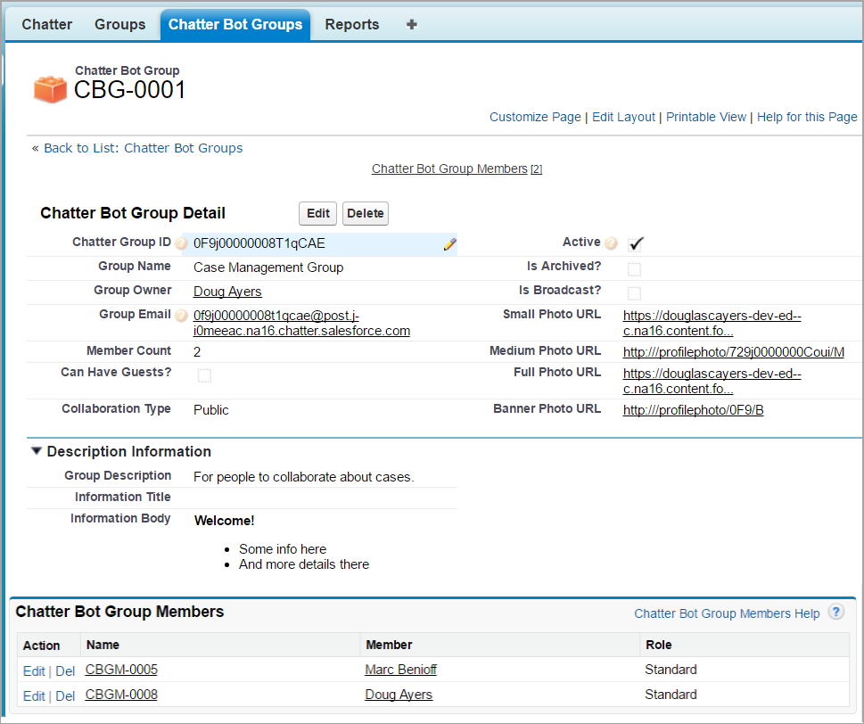
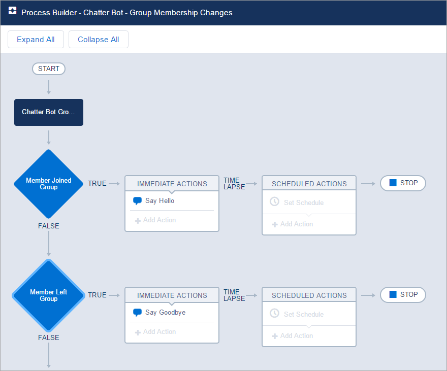
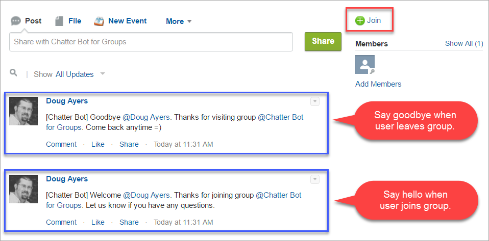

Salesforce Chatter Bot for Groups
=================================

Overview
--------

Chatter Bot for Groups is a way to easily listen for Chatter Groups being created or updated.
It also lets you take action when users are added or removed from those groups or their role within a group changes.
An example would be to automatically send welcome email or onboarding materials to new members of specific groups, like new hires.
Unfortunately, you cannot just leverage Process Builder to monitor for updates to [CollaborationGroup](https://developer.salesforce.com/docs/atlas.en-us.api.meta/api/sforce_api_objects_collaborationgroup.htm) or [CollaborationGroupMember](https://developer.salesforce.com/docs/atlas.en-us.api.meta/api/sforce_api_objects_collaborationgroupmember.htm) objects.
This project makes it easy by monitoring for updates on CollaborationGroup and CollaborationGroupMember objects and then updating custom objects that you can leverage within Process Builder.

Installation
----------------------

* [Deploy from Github](https://githubsfdeploy.herokuapp.com)

Getting Started
----------------------

1. Deploy code using link above.
2. Assign **Chatter Bot Groups Admin** permission set to your admin user.
3. Create a default organization default value for the **Chatter Bot Groups Setting** custom setting.
4. Switch to **Chatter Bot Groups** app.
5. Click on **Chatter Bot Group** tab and click New button. Enter a Chatter Group ID value in the `Chatter Group ID` field then click Save button.
6. Test it out! Update the Chatter Group's description or information text, or maybe add or remove someone from the group. Now navigate back to your **Chatter Bot Group** record to see it's been updated with current details.

Example Process Builder for Group Membership Changes
----------------------------------------------------

This project comes bundled with an example Process Builder that simply posts to a user's feed whenever that user joins or leaves a group. This example process only runs if the current user joins or leaves a group on their own accord, not if say a Group Manager or Admin adds or removes members. You can modify that by removing or modifying the 2nd condition of each Decision element in the Process: `[Chatter_Bot_Group_Member__c].LastModifiedById EQUALS REFERENCE [Chatter_Bot_Group_Member__c].Member__c`

Chatter Group Photos
--------------------

Although the **Chatter Bot Group** record has fields for various photo urls, the act of uploading or changing a Chatter Group's photo does not cause the triggers to fire and so that will not cause the **Chatter Bot Group** record to update. After a group's photo has changed then you'll need to navigate to the group's edit page and click Save to fire the trigger update event.

Chatter Group Membership Changes
--------------------------------

FYI, any time a user is added or removed from a group that will cause the **Chatter Bot Group** record to be updated because it's member count (`CollaborationGroup.MemberCount`) value changes.

Whenever a user is removed from a group then the associated **Chatter Bot Group Member** record will be upserted by setting the `Chatter_Bot_Group_Member__c.Is_Member__c` field to false, then the trigger will delete the record. The upsert occurs so that if desired you can leverage Workflow Rules or Process Builder to take action when users leave groups.

Deleted Chatter Groups
----------------------

If the Chatter Group (`CollaborationGroup`) record is **deleted** then the associated **Chatter Bot Group** record and its related **Chatter Bot Group Member** records are also deleted.

Existing Chatter Groups and Members
-----------------------------------

That's ok. Any time a user joins, leaves, or their role changes for a group then a **Chatter Bot Group Member** record is upserted. So if no record yet exists for that member then one will be created on the fly. If a record already exists for that member then it will be updated. This means once you setup Workflow Rules or Process Builder to handle group membership changes everything will work as expected without having to backfill historical data into the **Chatter Bot Group Member** object.
